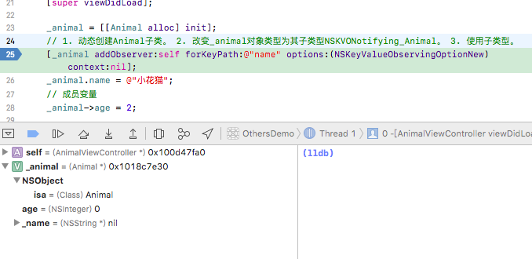
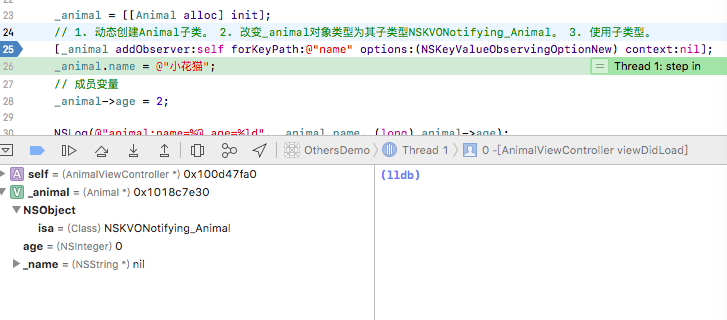

#### 内存
1. 栈区  
	栈是向着内存地址减小的方向增长的，由内存的高地址向低地址方向增长。内存地址连续，先进来的存放在栈底，所以先进后出，由系统自动分配释放空间。函数模块内申请，函数结束时由系统自动释放，存放局部变量，函数参数等。  
2. 堆区  
	堆是向着内存地址增加的方向增长的，从内存的低地址向高地址方向增长。内存地址不连续，由开发者自行申请、释放。C里malloc、create、copy、new默认开辟堆空间。
3. 全局区(静态区)  
	全局变量和静态变量的存储是放在一块的，程序运行时申请内存并初始化，程序结束后系统释放。未初始化的全局变量和未初始化的静态变量在一块区域，初始化的全局变量和静态变量在相邻的另一块区域(也称数据段和常量区在一起)。
4. 常量区  
	常量字符串就放在这里，程序运行时申请内存并初始化，程序结束后系统释放。
5. 代码区  
 	也称文本段，存放着程序的机器码和只读数据，可执行指令就是从这里取得的。存放函数体的二进制代码。  
6. 注意
	* 内存地址从高到低：  
	 	栈 -> 堆 -> 未初始化静态变量或全局变量 -> 已初始化静态变量或全局变量(常量区) -> 程序指令和只读数据(代码区)。
	* CFRelease和free都是释放内存空间，但是free有可能存在内存泄露，释放不干净，因为CoreFundation框架中的结构体内部也许还有指针指向堆区域，如果直接free会导致那部分堆区域无法释放，引起内存泄露。CFRelease把函数体里的指针指向的内存全部释放后再释放自己。dealloc函数是当在释放之前，让你可以做一些清空clear的操作。 
	* 栈帧是指为一个函数调用单独分配的那部分栈空间。比如，当运行中的程序调用另一个函数时，就要进入一个新的栈帧，原来函数的栈帧称为调用者的帧，新的栈帧称为当前帧。被调用的函数运行结束后当前帧全部收缩，回到调用者的帧。每个帧都是基于一个函数，帧随着函数的生命周期产生、发展和消亡。  


#### 运行时runtime
1. objc_msgSend
	* 需先将build setting中objc_msgSend值YES改为NO。
	* 如果调用有参数的方法，需要先定义原型再使用，否则会发生崩溃。

	```
	Person *p = [[Person alloc] init];
	void (*eat_msgsend)(id, SEL, NSString *) = (void (*)(id, SEL, NSString *))objc_msgSend;
	eat_msgsend(p, @selector(eatWithObject:), @"apple");
	
	// 在mac下可新建测试文件main.m和Person类然后使用clang -rewrite-objc main.m获取main.cpp查看其底层
	Person *p = [[Person alloc] init];在底层实现实质如下：
	Person *(*person_msgSend)(id, SEL) = (Person *(*)(id, SEL))(void *)objc_msgSend;
	Person *p2 = person_msgSend((id)person_msgSend((id)objc_getClass("Person"), sel_registerName("alloc")), sel_registerName("init"));
	```
[可参考代码https://github.com/east0422/Training/blob/feature/oc/othersdemo/oc/OthersDemo/OthersDemo/runtime/Person/PersonViewController.m](https://github.com/east0422/Training/blob/feature/oc/othersdemo/oc/OthersDemo/OthersDemo/runtime/Person/PersonViewController.m) 
 
2. method_exchangeImplementations 
	i. 需要在使用之前先调用，通常会放在load方法中

	```
	+ (void)load {  
		// class_getClassMethod是类方法，class_getInstanceMethod是对象方法
		Method originMethod = class_getClassMethod(self, @selector(URLWithString:));
		Method replacedMethod = class_getClassMethod(self, @selector(Verify_URLWithString:));
	    // 交换两个方法实现
	    method_exchangeImplementations(originMethod, replacedMethod);
	}  
	```

	ii. 在替代方法中不要调用原方法而需要调用自己否则的话会不断调用直到内存溢出，因为此时两个方法实现已经交换。

	```
	+ (instancetype)Verify_URLWithString:(NSString *)URLString {
	    // 注意：如果使用[NSURL URLWithString:URLString];会一直调用直到内存溢出
	    NSURL *url = [NSURL Verify_URLWithString:URLString];
	    if (url == nil) {
	        printf("url 为 nil\n");
	    }
	    return url;
	}
	```
	
	iii. NSURL中若有中文需对其编码否则会为null

	```
	NSString *urlString = [@"http://www.baidu.com/中文测试" stringByAddingPercentEncodingWithAllowedCharacters:[NSCharacterSet URLQueryAllowedCharacterSet]];
	```
[可参考代码https://github.com/east0422/Training/blob/feature/oc/othersdemo/oc/OthersDemo/OthersDemo/runtime/NSURLVerify/NSURLVerifyViewController.m](https://github.com/east0422/Training/blob/feature/oc/othersdemo/oc/OthersDemo/OthersDemo/runtime/NSURLVerify/NSURLVerifyViewController.m) 


#### KVO  

```
// Animal.h
@interface Animal : NSObject {
    @public
    NSInteger age; // 成员变量
}
// 这句话相当于定义成员变量_name并实现setter和getter方法
@property (nonatomic, copy) NSString *name;

@end

// AnimalViewController.m
_animal = [[Animal alloc] init];
// 1. 动态创建Animal子类。 2. 改变_animal对象类型为其子类型NSKVONotifying_Animal。 3. 使用子类型。
// 查看的话在此加个断点，第一次到这里的时候Command + Q停止当前任务，再重新打开再调试就可看到_animal的isa的改变
[_animal addObserver:self forKeyPath:@"name" options:(NSKeyValueObservingOptionNew) context:nil];
// 由@property (nonatomic, copy) NSString *name;
_animal.name = @"小花猫";
// 成员变量使用->
_animal->age = 2;
```  
原始类型Animal:  
  
子类型NSKVONotifying_Animal:  


[可参考代码https://github.com/east0422/Training/blob/feature/oc/othersdemo/oc/OthersDemo/OthersDemo/kvo/Animal/AnimalViewController.m](https://github.com/east0422/Training/blob/feature/oc/othersdemo/oc/OthersDemo/OthersDemo/kvo/Animal/AnimalViewController.m)

